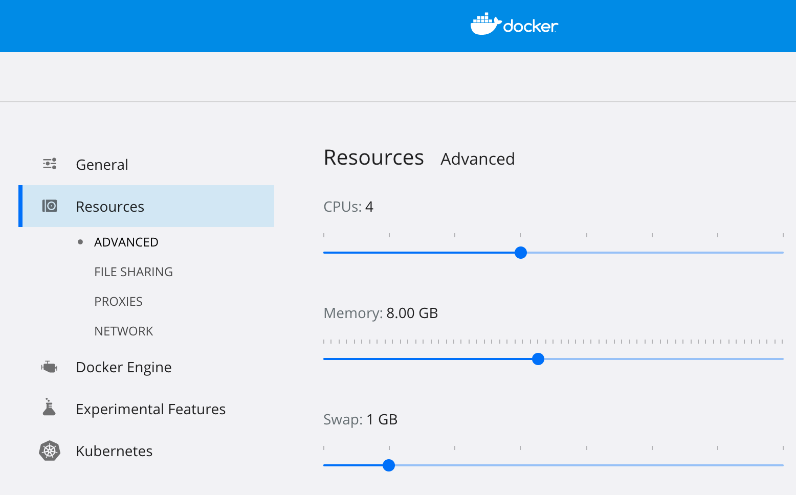

Note: This article is a translation of [「kindでNodeに割り当てるリソースを定義する」](https://nishipy.com/archives/1793). I posted the original on Dec 18 2020, so some information might be old.

There are some famous tools to create local Kubernetes clusters. [Kind](https://github.com/kubernetes-sigs/kind) is one of them. In this post, I introduce the way to allocate compute resources(memory and/or CPU) to nodes of [Kind](https://github.com/kubernetes-sigs/kind).

## Adjust resources for Docker Desktop

When using Kind, each node of a Kubernetes cluster is built as a Docker container. Therefore, first, configure the resources available to Docker in the Docker Desktop settings. Set them to about 4 CPU cores and 8GB of memory, for instance.




## Create a Kind configuration file

Next, we create a configuration file for Kind. You can get a general idea by looking at [Configuring Your kind Cluster](https://kind.sigs.k8s.io/docs/user/quick-start/#configuring-your-kind-cluster) in the documentation. It is a brief description of the cluster.

### Define multiple nodes in a cluster
For now, we will try to configure one Master and one Worker. All we need to do is to define the list under the `nodes`.

```
kind: Cluster
apiVersion: kind.x-k8s.io/v1alpha4
nodes:
- role: control-plane
- role: worker
```


### Define resources for nodes

According to [this issue](https://github.com/kubernetes-sigs/kind/issues/1524), you can define the resource allocation since the Kind cluster is created with [kubeadm](https://kubernetes.io/ja/docs/setup/production-environment/tools/kubeadm/install-kubeadm/). However, it does not seem to be a formal method, as you can find a comment like "kubelet configuration object is not respected per node in kubeadm currently, only from init".

```yaml
kind: Cluster
apiVersion: kind.x-k8s.io/v1alpha4
nodes:
- role: control-plane
  kubeadmConfigPatches:
  - |
    kind: InitConfiguration
    nodeRegistration:
      kubeletExtraArgs:
        system-reserved: memory=4Gi
- role: worker
  kubeadmConfigPatches:
  - |
    kind: JoinConfiguration
    nodeRegistration:
      kubeletExtraArgs:
        system-reserved: memory=4Gi
```

### Create a cluster with the configuration file

Use `--config` option to specify the configuration file.

```
$ kind create cluster --name=demo --config=$HOME/kind-config.yaml
Creating cluster "demo" ...
✓ Ensuring node image (kindest/node:v1.19.1) 
✓ Preparing nodes  
✓ Writing configuration 
✓ Starting control-plane &#xfe0f;
✓ Installing CNI 
✓ Installing StorageClass 
✓ Joining worker nodes 
Set kubectl context to "kind-demo"
You can now use your cluster with:
kubectl cluster-info --context kind-demo
Not sure what to do next?  Check out <https://kind.sigs.k8s.io/docs/user/quick-start/>
```


### Confirm the resource allocation

You will see that it is properly allocated with `kubectl describe node`.

```
$ kubectl get node	 	 
NAME STATUS ROLES AGE VERSION	 	 
demo-control-plane Ready master 76s v1.19.1	 	 
demo-worker Ready <none> 41s v1.19.1	 
	 
$ kubectl describe node demo-control-plane	 	 
Name: demo-control-plane	 	 
[...]	 	 
Allocatable:	 	 
 cpu: 4	 	 
 ephemeral-storage: 61255492Ki	 	 
 hugepages-1Gi: 0	 	 
 hugepages-2Mi: 0	 	 
 memory: 3958900Ki	 	 
 pods: 110	 	 
[...]	 	 

$ kubectl describe node demo-worker	 	 
Name: demo-worker	 	 
[...]	 	 
Allocatable:	 	 
 cpu: 4	 	 
 ephemeral-storage: 61255492Ki	 	 
 hugepages-1Gi: 0	 	 
 hugepages-2Mi: 0	 	 
 memory: 3958900Ki	 	 
 pods: 110	 
```

