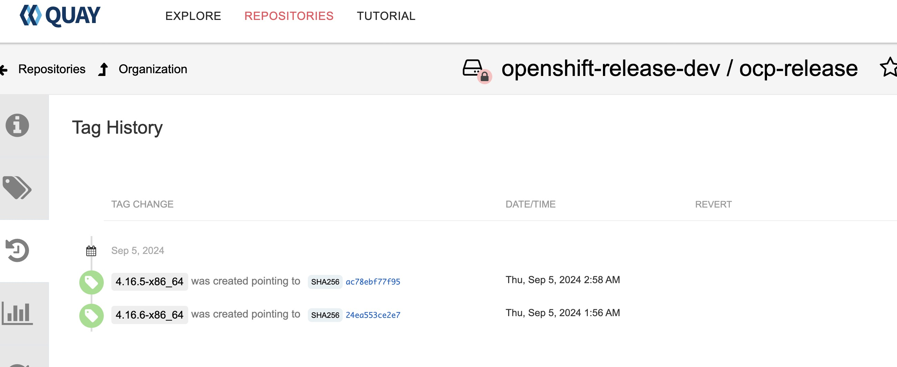
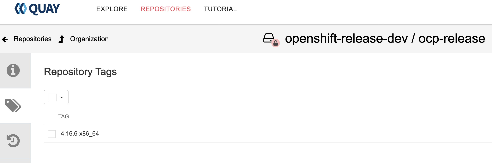
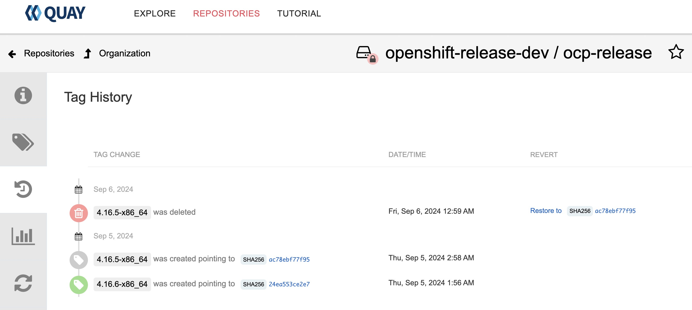

Header Photo by [Ivan Rohovchenko](https://unsplash.com/ja/@ivrn) on [Unsplash](https://unsplash.com/photos/black-telescope-during-day-time-8SjeH5pZbjw)

## oc-mirror plugin v2

インターネット接続性のない環境では、OpenShiftのインストールに必要なコンテナイメージやOperatorが使うコンテナイメージを、Red Hatが公開するインターネット上のコンテナレジストリからミラーレジストリにミラーリングする必要があります。そんなときに便利なoc-mirror pluginですが、バグの多いの機能の改善や再実装、新機能の追加をした[oc-mirror plugin v2](https://github.com/openshift/oc-mirror/tree/main/v2)の開発が進められています。詳細は、[OpenShift 4.16のリリースノートのこの辺り](https://docs.openshift.com/container-platform/4.16/release_notes/ocp-4-16-release-notes.html#ocp-4-16-oc-mirror-v2_release-notes)をご確認ください。

なお、[OpenShift 4.16時点では、oc-mirror plugin v2によるミラーリングはTech Preview](https://docs.openshift.com/container-platform/4.16/installing/disconnected_install/about-installing-oc-mirror-v2.html)です。

今回は、oc-mirror plugin v2で追加された、ミラーレジストリ上にあるイメージ削除の機能で遊んでみたいと思います。

## oc-mirror pluginによるミラーリングとイメージ削除
従来のoc-mirror v1では、ミラーリング実行時に、前回までのミラーリングの履歴から自動でイメージをプルーニングするため、利用者が明示的にイメージを削除することはありませんでした。
この挙動は一見便利そうですが、`ImageSetConfiguration` という設定ファイルをわりと作成・更新しないと意図しないイメージを消してしまうこともしばしばありました。またバグが報告されることも多かったそうで、oc-mirror plugin v2では、自動でプルーニングを行わないように根本的に実装が見直されています。

### `DeleteImageSetConfiguration` の導入
oc-mirror では、`ImageSetConfiguration` という設定ファイルにミラーリング対象のコンテナイメージを定義していました。v1では、このファイルの変更履歴から削除対象となるイメージを自動で算出していたわけですが、v2からは `DeleteImageSetConfiguration` が導入され、`ImageSetConfiguration` と同じような書式で削除したいイメージを明示的に定義することができます。

## oc-mirror v2でイメージ削除してみる

### イメージのミラーリング
ミラーレジストリからイメージを削除してみたいのですが、そもそも消すイメージがないので、まずミラーリングを実行します。以下のような内容の `ImageSetConfiguration` で、OpenShift 4.16.5 と 4.16.6のリリースイメージをミラーリングしてみます。v1と比較して、CRD(のようなもの)の`kind`は同じですが、`apiVersion` が異なるため注意してください。

```yaml
kind: ImageSetConfiguration
apiVersion: mirror.openshift.io/v2alpha1
mirror:
  platform:
    channels:
    - name: stable-4.16
      minVersion: 4.16.5
      maxVersion: 4.16.6
```

なお、ミラーレジストリには、[Mirror registry for Red Hat OpenShift](https://docs.openshift.com/container-platform/4.16/installing/disconnected_install/installing-mirroring-creating-registry.html)を使うのが簡単です。OpenShiftインストールのためのミラーリング用途限定で、PodmanでRed Hat Quayをデプロイしてくれます。この記事ではミラーレジストリの構築は省略します。

ミラーレジストリへログイン後、ミラーリングを実行します。

```
$ podman login registry.ocp4.tanishim.local:8443 -u init --authfile mirror-pull-secret.txt
Password:
Login Succeeded!

$ oc mirror --v2 --authfile mirror-pull-secret.txt -c ./imagesetconfig.yaml --workspace file://./v2-workspace docker://registry.ocp4.tanishim.local:8443
...
2024/09/04 16:14:01  [INFO]   : _  setting up the environment for you...
2024/09/04 16:14:01  [INFO]   : __ workflow mode: mirrorToMirror
2024/09/04 16:14:01  [INFO]   : _  going to discover the necessary images...
2024/09/04 16:14:01  [INFO]   : __ collecting release images...
2024/09/04 16:14:02  [INFO]   : __ collecting operator images...
2024/09/04 16:14:02  [INFO]   : __ collecting additional images...
2024/09/04 16:14:02  [INFO]   : __ Start copying the images...
2024/09/04 16:14:05  [INFO]   : === Overall Progress -  image 1 / 384 ===
2024/09/04 16:14:05  [INFO]   :  release image 1 / 384
2024/09/04 16:14:05  [INFO]   :  image: quay.io/openshift-release-dev/ocp-v4.0-art-dev@sha256:5bb98edf376dfa838ce6899b0fc0e867237f34df63e8bf476d0ba9d2195131bd
2024/09/04 16:14:05  [INFO]   : =========================================
2024/09/04 16:14:07  [INFO]   : === Overall Progress -  image 2 / 384 ===
2024/09/04 16:14:07  [INFO]   :  release image 2 / 384
2024/09/04 16:14:07  [INFO]   :  image: quay.io/openshift-release-dev/ocp-v4.0-art-dev@sha256:6a8a7825b2039759548c6d83db384979cf4bf0a17d231c2a588c57e80623f74c
2024/09/04 16:14:07  [INFO]   : =========================================
2024/09/04 16:14:15  [INFO]   : === Overall Progress -  image 3 / 384 ===
2024/09/04 16:14:15  [INFO]   :  release image 3 / 384
2024/09/04 16:14:15  [INFO]   :  image: quay.io/openshift-release-dev/ocp-v4.0-art-dev@sha256:667efccd05c2154ebda8ae7a14fbb3ed4523ad8c1f459df9eda77a041239ae1c
2024/09/04 16:14:15  [INFO]   : =========================================
2024/09/04 16:14:19  [INFO]   : === Overall Progress -  image 4 / 384 ===
2024/09/04 16:14:19  [INFO]   :  release image 4 / 384
2024/09/04 16:14:19  [INFO]   :  image: quay.io/openshift-release-dev/ocp-v4.0-art-dev@sha256:355407f1b51db63278a581de341542521972e68c607a0e10f521733795619214
2024/09/04 16:14:19  [INFO]   : =========================================
2024/09/04 16:14:26  [INFO]   : === Overall Progress -  image 5 / 384 ===
2024/09/04 16:14:26  [INFO]   :  release image 5 / 384
2024/09/04 16:14:26  [INFO]   :  image: quay.io/openshift-release-dev/ocp-v4.0-art-dev@sha256:041d983c6807129d0e0cf371133f8a1c0d5fde78a813c60aa1f293e64004fb43
2024/09/04 16:14:26  [INFO]   : =========================================
__2024/09/04 16:14:31  [INFO]   : === Overall Progress -  image 6 / 384 ===
2024/09/04 16:14:31  [INFO]   :  release image 6 / 384
...
2024/09/04 17:58:09  [INFO]   : === Overall Progress -  image 384 / 384 ===
2024/09/04 17:58:09  [INFO]   :  release image 384 / 384
2024/09/04 17:58:09  [INFO]   :  image: quay.io/openshift-release-dev/ocp-release:4.16.5-x86_64
2024/09/04 17:58:09  [INFO]   : ===========================================
2024/09/04 17:58:09  [INFO]   : === Results ===
2024/09/04 17:58:09  [INFO]   : All release images mirrored successfully 384 / 384 __
2024/09/04 17:58:09  [INFO]   : __ Generating IDMS file...
2024/09/04 17:58:09  [INFO]   : v2-workspace/working-dir/cluster-resources/idms-oc-mirror.yaml file created
2024/09/04 17:58:09  [INFO]   : __ Generating ITMS file...
2024/09/04 17:58:09  [INFO]   : v2-workspace/working-dir/cluster-resources/itms-oc-mirror.yaml file created
2024/09/04 17:58:09  [INFO]   : __ No catalogs mirrored. Skipping CatalogSource file generation.
2024/09/04 17:58:09  [INFO]   : mirror time     : 1h44m7.951974594s
2024/09/04 17:58:09  [INFO]   : __ Goodbye, thank you for using oc-mirror
```


oc-mirrorを使ったことがある方ならわかると思いますが、標準出力されるログの見やすさが桁違いです。プログレスバーのように、ミラーリングの進捗がわかりやすいですし、タイムスタンプも有用です。
`--workspace` というフラグはoc-mirror v2で追加された便利機能の1つです。指定したディレクトリに、こんな感じでアーティファクトが生成されていました。ログやミラーしたOperator、OpenShift リリースの情報、インストール後クラスタに適用する `ImageDigestMirrorSet` および `ImageTagMirrorSet` のYAMLマニフェストが入ります

```
$ tree v2-workspace/ -d
v2-workspace/
`-- working-dir
    |-- cluster-resources
    |-- hold-operator
    |-- hold-release
    |   `-- ocp-release
    |       |-- 4.16.5-x86_64
    |       |   `-- release-manifests
    |       `-- 4.16.6-x86_64
    |           `-- release-manifests
    |-- info
    |-- logs
    |-- release-filters
    |-- release-images
    |   `-- ocp-release
    |       |-- 4.16.5-x86_64
    |       |   `-- blobs
    |       |       `-- sha256
    |       `-- 4.16.6-x86_64
    |           `-- blobs
    |               `-- sha256
    `-- signatures
```

```
$ cat v2-workspace/working-dir/cluster-resources/*.yaml
---
apiVersion: config.openshift.io/v1
kind: ImageDigestMirrorSet
metadata:
  name: idms-release-0
spec:
  imageDigestMirrors:
  - mirrors:
    - registry.ocp4.tanishim.local:8443/openshift-release-dev
    source: quay.io/openshift-release-dev
status: {}
---
apiVersion: config.openshift.io/v1
kind: ImageTagMirrorSet
metadata:
  name: itms-release-0
spec:
  imageTagMirrors:
  - mirrors:
    - registry.ocp4.tanishim.local:8443/openshift-release-dev
    source: quay.io/openshift-release-dev
status: {}
```

Mirror Registry側を念の為確認すると、今回ミラーリングしたOCP 4.16.5と4.16.6 のリリースイメージが入っています。



### `DeleteImageSetConfiguration` によるイメージの削除

いよいよ本題です。4.16.5用のイメージだけを削除してみます。以下の内容で作成した `DeleteImageSetConfiguration` と先ほどミラーリングした際に生成されたメタデータを読み込んで、イメージ削除に必要な設定ファイルを生成します。`oc mirror delete` コマンドに `--generate` フラグをつけるという、なんともややこしい感じです。

```yaml
apiVersion: mirror.openshift.io/v2alpha1
kind: DeleteImageSetConfiguration
delete:
  platform:
    channels:
      - name: stable-4.16
        minVersion: 4.16.5
        maxVersion: 4.16.5
```

```
$ oc mirror --v2 delete --generate --authfile mirror-pull-secret.txt --config deleteimagesetconfig.yaml --workspace file://./v2-workspace docker://registry.ocp4.tanishim.local:8443
2024/09/05 15:48:04  [WARN]   : _  --v2 flag identified, flow redirected to the oc-mirror v2 version. This is Tech Preview, it is still under development and it is not production ready.
2024/09/05 15:48:04  [INFO]   : __ Hello, welcome to oc-mirror
2024/09/05 15:48:04  [INFO]   : _  setting up the environment for you...
2024/09/05 15:48:04  [INFO]   : __ workflow mode: mirrorToMirror / delete
2024/09/05 15:48:04  [INFO]   : _  going to discover the necessary images...
2024/09/05 15:48:04  [INFO]   : __ collecting release images...
2024/09/05 15:48:04  [INFO]   : __ collecting operator images...
2024/09/05 15:48:04  [INFO]   : __ collecting additional images...
2024/09/05 15:48:04  [INFO]   : __ Generating delete file...
2024/09/05 15:48:04  [INFO]   : v2-workspace/working-dir/delete file created
v2-workspace/working-dir/delete2024/09/05 15:49:31  [INFO]   : delete time     : 1m26.960963111s
2024/09/05 15:49:31  [INFO]   : __ Goodbye, thank you for using oc-mirror
```

`v2-workspace/working-dir/delete` に何か作ってくれたようです。見てみましょう。

```
$ ls v2-workspace/working-dir/delete
delete-images.yaml  delete-imageset-config.yaml

$ cat v2-workspace/working-dir/delete/delete-imageset-config.yaml
apiVersion: mirror.openshift.io/v2alpha1
delete:
  helm: {}
  platform:
    architectures:
    - amd64
    channels:
    - maxVersion: 4.16.5
      minVersion: 4.16.5
      name: stable-4.16
      type: ocp
kind: DeleteImageSetConfiguration

$ cat v2-workspace/working-dir/delete/delete-images.yaml
...
- imageName: quay.io/openshift-release-dev/ocp-v4.0-art-dev@sha256:ffeb6edc9f09e75011c3547b2149b8120c68e7721d8ba2e7a6d659e6c83229bc
  imageReference: docker://registry.ocp4.tanishim.local:8443/openshift-release-dev/ocp-v4.0-art-dev@sha256:ffeb6edc9f09e75011c3547b2149b8120c68e7721d8ba2e7a6d659e6c83229bc
  relatedBlobs:
  - sha256:86592d87dea5f0c55992dc4aadd236cde96f5e4f3d3dfd0456ca38dca2d2e151
  - sha256:9a0e86afac7b17960e2411a55e234d639aead65defac982719003eaa242da807
  - sha256:b958cf13e572cbd92209b5c01a8e65203cf88c4b017258ec8ff9bfd5d722b715
  - sha256:ca1636478fe5b8e2a56600e24d6759147feb15020824334f4a798c1cb6ed58e2
  - sha256:e5e8178c6af6b5832361eb52e25232f851a6979c63bbad694e063afdd71ca459
  - sha256:ffeb6edc9f09e75011c3547b2149b8120c68e7721d8ba2e7a6d659e6c83229bc
kind: DeleteImageList
```

`DeleteImageSetConfiguration` と `DeleteImageList` のマニフェストが作成されています。前者は先ほど自分で与えたファイルと同じ内容です。後者は、それを元に実際に削除対象となるイメージとダイジェストをリストにしたもののようです。この段階ではイメージの削除は行われていません。先ほど生成された `DeleteImageList` のYAMLファイル `delete-images.yaml`を使って削除処理を実行します。

```
$ oc mirror --v2 delete --authfile mirror-pull-secret.txt --delete-yaml-file ./v2-workspace/working-dir/delete/delete-images.yaml docker://registry.ocp4.tanishim.local:8443
...
2024/09/05 16:01:03  [INFO]   :  image: quay.io/openshift-release-dev/ocp-v4.0-art-dev@sha256:ffbe0d4c61d5a2e42923b1d063179bbd99fe2bf7a679c5a2f1ae444ba0d5d6c6
2024/09/05 16:01:03  [INFO]   : ===========================================
2024/09/05 16:01:03  [INFO]   : === Overall Progress -  image 192 / 192 ===
2024/09/05 16:01:03  [INFO]   :  image: quay.io/openshift-release-dev/ocp-v4.0-art-dev@sha256:ffeb6edc9f09e75011c3547b2149b8120c68e7721d8ba2e7a6d659e6c83229bc
2024/09/05 16:01:03  [INFO]   : ===========================================
2024/09/05 16:01:03  [INFO]   : === Results ===
2024/09/05 16:01:03  [INFO]   : All images deleted successfully 192 / 192 __
2024/09/05 16:01:03  [INFO]   : delete time     : 1m33.308334555s
2024/09/05 16:01:03  [INFO]   : __ Remember to execute a garbage collect (or similar) on your remote repository
2024/09/05 16:01:03  [INFO]   : __ Goodbye, thank you for using oc-mirror
```

完了後、ミラーレジストリを見てみると、期待した通り、4.16.5のリリースイメージ(のタグ)だけが削除されたことが確認できます。





## 余談
### oc-mirror v2のイメージ削除の注意点

oc-mirror v2の新機能である `DeleteImageSetConfiguration` によるイメージ削除では、イメージのマニフェストのみを削除しています。そのため、ストレージの使用量は減りません。不要なイメージの実体を削除し、ストレージを空けたい場合は、コンテナレジストリ側でガーベージコレクションを有効にしてください。なお、[Red Hat Quay では、ガーベージコレクションはデフォルトで有効](https://docs.redhat.com/en/documentation/red_hat_quay/3/html/manage_red_hat_quay/garbage-collection#garbage-collection-configuration-fields)になっています。今回使ったOpenShift Mirror Registryも中身はQuayなので同様です。

### oc-mirror on RHEL 8
最近のバージョンのoc-mirrorをRHEL 8で実行しようとすると、以下のようなエラーが出るかもしれません。

```
/lib64/libc.so.6: version `GLIBC_2.33' not found
```

RHEL 8の`glibc` のバージョンが、`glibc-2.28` であるためです。このような場合、RHEL 8のマシンでUBI 9なPodmanコンテナで一時対処する方法があります。以下のようにコンテナを実行し、bashセッションを起動して、oc-mirrorを試せばよいでしょう。必要であれば、ホストOS上にあるミラーレジストリのプルシークレットやCA証明書をコピーします。

```
$ podman run -dt -v ./:/oc-mirror:Z --name ubi9 registry.redhat.io/ubi9
$ podman exec -it ubi9 /bin/bash
```