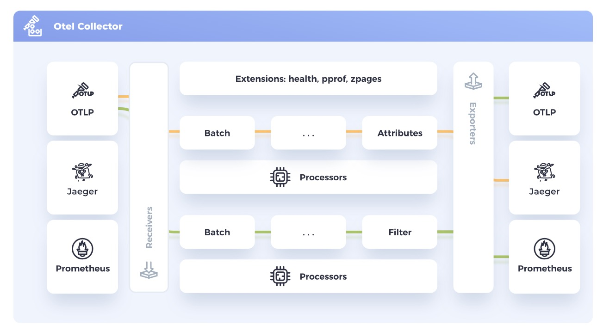

Header Photo by [Matthew Ansley](https://unsplash.com/ja/@ansleycreative) on [Unsplash](https://unsplash.com/photos/black-telescope-during-day-time-8SjeH5pZbjw)

## OpenTelemetry

[OpenTelemetry](https://opentelemetry.io/docs/what-is-opentelemetry/)(OTEL)は、CNCFのプロジェクトの1つです。Observabilityの重要性が語られ始めて久しい昨今ですが、OTELはクラウドネイティブなソフトウェアにおいてObsevabilityを実現するためのAPI、SDK、ツール群です。GitHubにたくさんの[関連リポジトリ](https://github.com/orgs/open-telemetry/repositories)があります。

メトリクス、ログ、トレースを合わせてテレメトリデータと呼んでいます。OpenTelemetryを使ソフトウェアを計装し、テレメトリの生成、収集、エクスポートが行えます。オープンソースかつベンダー(vendor neutral)に依存しない点も特長です。

### OpenTelemetry Collector

> 
> https://opentelemetry.io/docs/collector/ より引用

OpenTelemetry Collectorは、さまざまなテレメトリデータを受信、処理、エクスポートするためのコンポーネントです。以下の図のように、Jeager、Prometheusなどからテレメトリデータを受信し、処理した後、バックエンドにデータを送信できます。これにより複数のエージェント/コレクターを管理・運用する必要がなくなります。

## Red Hat build of OpenTelemetry

UpstreamのOpenTelemetryプロジェクトに基づいた製品で、OpenShift上におけるOpenTelemetry Collector のデプロイと管理、さらにワークロードの計装の簡素化をサポートします。つまり、OTEL Collectorの導入や自動計装などを、OpenShiftクラスタおよびその上で動くワークロードに提供します。

OpenShiftでは、(OpenShiftらしく、)Operatorを使ってOpenTelemetry Collectorをデプロイします。具体的には、OperatorHubからRed Hat build of OpenTelemetry Operatorをインストールした後、`OpenTelemetryCollector` CRを作成します。`OpenTelemetryCollector` CRの `spec.onfig`には、主に以下の項目を設定します。

- **Receiver: データを取り込む。OTLP Receiver、Jaeger Receiver、Prometheus Receiver (Tech Preview)などのプロトコルがある**
- **Processor:** データが受信されてからエクスポートされるまでの間のデータ処理。Batch Processor、Memory Limiter processorなどがある
- **Exporter:** データを1つ以上のバックエンドや宛先に送信する。**OTLP exporter、OTLP HTTP exporter、Debug exporter、Prometheus exporterなどのプロトコルがサポートされる**

詳細は、[ドキュメント](https://docs.openshift.com/container-platform/4.14/observability/otel/otel-configuration-of-otel-collector.html#otel-collector-config-options_otel-configuration-of-otel-collector)を参照してください。

## Red Hat build of OpenTelemetryで遊ぶ

Red Hat build of OpenTelemetryおよびOTELがなにもわからなかったので、[Sidecar injectionを用いてOTEL Collectorをワークロードに挿入する方法](https://docs.openshift.com/container-platform/4.14/observability/otel/otel-sending-traces-and-metrics-to-otel-collector.html)を試してみました。サンプルアプリ(Go)とYAMLマニフェストたちは、[こちら](https://github.com/nishipy/go-otel-openshift)に置いておきます。今回使った環境は以下の通りです。

- OpenShift: v4.14.20
- OpenTelemetry Operator: v0.93.0-3

### Red Hat build of OpenTelemetryのインストール

前述の通り、OperatorHubからRed Hat build of OpenTelemetry (OpenTelemetry Operator)をインストールします。[ドキュメント](https://docs.openshift.com/container-platform/4.14/observability/otel/otel-installing.html#installing-otel-by-using-the-cli_install-otel)に従って実行すればOKです。

```
$ oc version
Client Version: 4.12.10
Kustomize Version: v4.5.7
Server Version: 4.14.20
Kubernetes Version: v1.27.11+ec42b99

$ oc get csv | grep opentelemetry-operator
opentelemetry-operator.v0.93.0-3   Red Hat build of OpenTelemetry                   0.93.0-3   opentelemetry-operator.v0.93.0-2   Succeeded
```

### サンプルワークロード用コンテナイメージ作成

今回テレメトリデータをCollectorに送信するため、コンテナイメージを作成します。[こんな感じ](https://github.com/nishipy/go-otel-openshift/blob/main/cmd/sampleapp/main.go)でGoでOTELライブラリを使い計装してみました。

```go
package main

import (
	"context"
	"log"
	"net/http"
	"time"

	"go.opentelemetry.io/otel"
	"go.opentelemetry.io/otel/codes"
	"go.opentelemetry.io/otel/exporters/otlp/otlptrace/otlptracegrpc"
	"go.opentelemetry.io/otel/sdk/trace"
)

func main() {
	ctx := context.Background()
	exp, err := otlptracegrpc.New(
		ctx,
		otlptracegrpc.WithInsecure(),
	)
	if err != nil {
		panic(err)
	}

	tracerProvider := trace.NewTracerProvider(trace.WithBatcher(exp))
	defer func() {
		if err := tracerProvider.Shutdown(ctx); err != nil {
			panic(err)
		}
	}()
	otel.SetTracerProvider(tracerProvider)

	http.HandleFunc("/", func(w http.ResponseWriter, r *http.Request) {
		tr := otel.Tracer("http-server")
		_, span := tr.Start(r.Context(), "handleRequest")
		defer span.End()

		// Simulate some work
		time.Sleep(100 * time.Millisecond)
		span.SetStatus(codes.Ok, "Status is OK.")

		w.Write([]byte("Hello, world!\n"))
	})

	// Start the HTTP server
	port := ":8080"
	log.Printf("Starting server on port %s...", port)
	if err := http.ListenAndServe(port, nil); err != nil {
		log.Fatalf("failed to start server: %v", err)
	}
}
```

これを以下のようなDockerfileを使ってコンテナイメージをビルドします。ビルドしたものは、`ghcr.io/nishipy/go-otel-sample:latest` にも置いてあります。

```dockerfile
FROM golang:1.21.3-alpine as builder
WORKDIR /app
COPY go.mod go.sum ./
RUN go mod download go.opentelemetry.io/otel
COPY ./cmd/sampleapp/*.go ./
RUN go build -trimpath -ldflags="-w -s" -o "otel-sample"

FROM gcr.io/distroless/static-debian11
COPY --from=builder /app/otel-sample /otel-sample
CMD ["/otel-sample"]
```

### サンプルワークロードのデプロイ

ビルドしたコンテナイメージを使って、ワークロードをデプロイし、`Route` を用いて公開してみましょう。まず、Deploymentを作成します。現時点では何の意味もないですが`sidecar.opentelemetry.io/inject: "true"` というアノテーションがポイントです。次節で作成する `OpenTelemetryCollector` CRによって追加されるAdmission Webhookがこのアノテーションを検知し、OTEL Collectorコンテナを挿入してくれます。

```yaml
---
apiVersion: v1
kind: Namespace
metadata:
  name: otel-sample
---
apiVersion: apps/v1
kind: Deployment
metadata:
  name: otel-sample-deployment
  namespace: otel-sample
spec:
  serviceAccount: otel-collector-sidecar
  replicas: 1
  selector:
    matchLabels:
      app: otel-sample
  template:
    metadata:
      labels:
        app: otel-sample
      annotations:
        sidecar.opentelemetry.io/inject: "true"
    spec:
      containers:
      - name: otel-sample
        image: ghcr.io/nishipy/go-otel-sample:latest
        ports:
        - containerPort: 8080
```

作成したPodはRouteで公開します。
```yaml
---
apiVersion: v1
kind: Service
metadata:
  name: otel-sample-service
  namespace: otel-sample
spec:
  selector:
    app: otel-sample
  ports:
    - protocol: TCP
      port: 8080
      targetPort: 8080
  type: ClusterIP
---
apiVersion: route.openshift.io/v1
kind: Route
metadata:
  name: otel-sample-route
  namespace: otel-sample
spec:
  to:
    kind: Service
    name: otel-sample-service
    weight: 100
  port:
    targetPort: 8080
```

これらのYAMLマニフェストを適用すると、以下のようにPodやRouteが作成されるはずです。

```
$ oc get pod
NAME                                     READY   STATUS    RESTARTS   AGE
otel-sample-deployment-b8696df8d-7xkll   1/1     Running   0          39s
$ oc get route
NAME                HOST/PORT                                           PATH   SERVICES              PORT   TERMINATION   WILDCARD
otel-sample-route   otel-sample-route-otel-sample.apps.test.lab.local          otel-sample-service   8080                 None
$ curl -I otel-sample-route-otel-sample.apps.test.lab.local
HTTP/1.1 200 OK
date: Mon, 06 May 2024 14:34:48 GMT
content-length: 14
content-type: text/plain; charset=utf-8
set-cookie: 27c7a5203dbedf674a50081de44f4d21=f3ceec06cdf162006c6cd294f3279af3; path=/; HttpOnly
```

## OpenTelemetry Collector の設定

[ドキュメント](https://docs.openshift.com/container-platform/4.14/observability/otel/otel-sending-traces-and-metrics-to-otel-collector.html#sending-traces-and-metrics-to-otel-collector-with-sidecar_otel-sending-traces-and-metrics-to-otel-collector)に従って、OpenTelemetry Collectorをサイドカーコンテナとして挿入しましょう。まず前段として、OTEL Collectorサイドカーコンテナのために必要な`ServiceAccount`および`ClusterRole`、`ClusterRoleBinding`を作成します。

```yaml
---
apiVersion: v1
kind: ServiceAccount
metadata:
  name: otel-collector-sidecar
  namespace: otel-sample
---
apiVersion: rbac.authorization.k8s.io/v1
kind: ClusterRole
metadata:
  name: otel-collector
rules:
- apiGroups: ["", "config.openshift.io"]
  resources: ["pods", "namespaces", "infrastructures", "infrastructures/status"]
  verbs: ["get", "watch", "list"]
---
apiVersion: rbac.authorization.k8s.io/v1
kind: ClusterRoleBinding
metadata:
  name: otel-collector
subjects:
- kind: ServiceAccount
  name: otel-collector-sidecar
  namespace: otel-sample
roleRef:
  kind: ClusterRole
  name: otel-collector
  apiGroup: rbac.authorization.k8s.io
```

次に、`OpenTelemetryCollector` CRを作成します。Export先にTempoのインスタンスを用意するのは骨が折れそうなので、今回は以下のようにします。(ちなみにドキュメントの設定をコピペしても、`service.pipelines` の設定が間違っていたり、serviceAccountを指定するインデントが間違っていたりして、エラーになると思うのでご注意ください)

```yaml
apiVersion: opentelemetry.io/v1alpha1
kind: OpenTelemetryCollector
metadata:
  name: otel
  namespace: otel-sample
spec:
  serviceAccount: otel-collector-sidecar
  mode: sidecar
  config: |
    receivers:
      otlp:
        protocols:
          grpc:
          http:
    processors:
      batch:
      memory_limiter:
        check_interval: 1s
        limit_percentage: 50
        spike_limit_percentage: 30
      resourcedetection:
        detectors: [openshift]
        timeout: 2s
    exporters:
      debug:
        verbosity: detailed
    service:
      pipelines:
        traces:
          receivers: [otlp]
          processors: [memory_limiter, resourcedetection, batch]
          exporters: [debug]
        metrics:
          receivers: [otlp]
          processors: [memory_limiter, resourcedetection, batch]
          exporters: [debug]
```

`spec.mode: sidecar` を設定することにより、OTEL Collectorサイドカーコンテナを、`sidecar.opentelemetry.io/inject: "true"` アノテーションを持つPodに挿入します。

Receiverとしては、[OTLP Receiver](https://docs.openshift.com/container-platform/4.14/observability/otel/otel-configuration-of-otel-collector.html#otlp-receiver_otel-configuration-of-otel-collector)を使っています。これはGoで書いたサンプルコード内で、OTLPプロトコル(over gRPC)を使ってトレースを生成しているためです。また、Exporterには、[Debug Exporter](https://docs.openshift.com/container-platform/4.14/observability/otel/otel-troubleshooting.html#debug-exporter-to-stdout_otel-troubleshoot)を使います。その名の通り、デバッグ用にテレメトリデータを標準出力にエクスポートします。

YAMLマニフェストを適用すると、以下のように `mutating webhook` が見えるはずです。

```
$ oc get mutatingwebhookconfigurations.admissionregistration.k8s.io -l olm.owner.namespace=openshift-opentelemetry-operator
NAME                                  WEBHOOKS   AGE
minstrumentation.kb.io-ddjq4          1          20d
mopampbridge.kb.io-5hkkl              1          20d
mopentelemetrycollector.kb.io-4bfwl   1          20d
mpod.kb.io-7dmnz                      1          20d
```

## OpenTelemetry Collector sidecar の挿入

`mutating webhook` も用意できたので、実験用にデプロイしていたPodを再作成しましょう。Admission Webhookにより、OpenTelemetry Collectorがサイドカーコンテナとして追加されるはずです。Podを一旦削除すると再作成され、READY列が `2/2` になり、サイドカーコンテナが挿入されたことがわかります。準備完了です。

```
$ oc get pod
NAME                                     READY   STATUS    RESTARTS   AGE
otel-sample-deployment-b8696df8d-7xkll   1/1     Running   0          8m31s
$ oc delete pod otel-sample-deployment-b8696df8d-7xkll
pod "otel-sample-deployment-b8696df8d-7xkll" deleted
$ oc get pod
NAME                                     READY   STATUS    RESTARTS   AGE
otel-sample-deployment-b8696df8d-gc6hg   2/2     Running   0          37s
```

試しにRoute経由でPodにcurlでアクセスした後、OpenTelemetry Collectorのサイドカーコンテナ(`otc-container`)を覗いてみると、テレメトリデータが表示されているのがわかります。

```
$ curl -I otel-sample-route-otel-sample.apps.test.lab.local
$ oc logs otel-sample-deployment-b8696df8d-gc6hg otc-container
2024-05-06T14:45:02.667Z        info    TracesExporter  {"kind": "exporter", "data_type": "traces", "name": "debug", "resource spans": 1, "spans": 1}
2024-05-06T14:45:02.667Z        info    ResourceSpans #0
Resource SchemaURL: https://opentelemetry.io/schemas/1.24.0
Resource attributes:
     -> service.name: Str(unknown_service:otel-sample)
     -> telemetry.sdk.language: Str(go)
     -> telemetry.sdk.name: Str(opentelemetry)
     -> telemetry.sdk.version: Str(1.26.0)
ScopeSpans #0
ScopeSpans SchemaURL: 
InstrumentationScope http-server 
Span #0
    Trace ID       : a1964374ea412edf92ee5d4f843071ab
    Parent ID      : 
    ID             : 8fbada7e64abb4bf
    Name           : handleRequest
    Kind           : Internal
    Start time     : 2024-05-06 14:45:01.285150513 +0000 UTC
    End time       : 2024-05-06 14:45:01.385644776 +0000 UTC
    Status code    : Ok
    Status message : 
        {"kind": "exporter", "data_type": "traces", "name": "debug"}
...
```