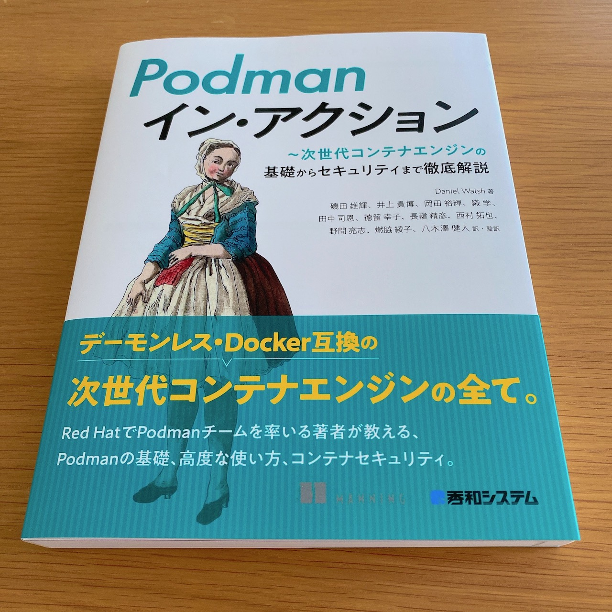

Header Photo by [Amy Asher](https://unsplash.com/@amyannaasher?utm_content=creditCopyText&utm_medium=referral&utm_source=unsplash) on [Unsplash](https://unsplash.com/photos/white-seal-on-soil-giZJHm2m9yY?utm_content=creditCopyText&utm_medium=referral&utm_source=unsplash)

## 🦭 はじめに

[Red Hat Advent Calendar 2023](https://qiita.com/advent-calendar/2023/redhat) 17日目の記事🎅です。
ちなみにすべて [個人の見解](https://xn--u9jy52g42am02luma.jp/) です。

## 🦭 `podman-generate-systemd` の非推奨化と Quadlet

エッジ等のユースケースで、systemdのサービスユニットとしてPodmanコンテナやPodを制御したい場合、従来は [`podman generate systemd`](https://docs.podman.io/en/latest/markdown/podman-generate-systemd.1.html) というコマンドを使って、既存のコンテナやPodからユニットファイルを生成していました。2023年9月に発売された書籍[Podmanイン・アクション](https://www.shuwasystem.co.jp/book/9784798070209.html)([Podman in Action](https://www.manning.com/books/podman-in-action)をFedora 38/Podman v4.5.1を前提に日本語訳したもの) の「7章 systemdとの統合」でも、この方法を紹介しています。



Podman v4.7.0 で、この [`podman generate systemd](https://docs.podman.io/en/latest/markdown/podman-generate-systemd.1.html) はdeprecated(非推奨)となりました。systemdのもとでPodmanコンテナやPodを実行したい場合は、[Podman v4.7.0 のリリースノート](https://github.com/containers/podman/releases/tag/v4.7.0)に記載がある通り、[Quadlet](https://docs.podman.io/en/latest/markdown/podman-systemd.unit.5.html) を使うことが推奨されています。以下の記載があります。

> The podman generate systemd command is deprecated. Use Quadlet for running containers and pods under systemd.

## 🦭 Quadlet を完全に理解する

### QuadletとPodman

[Quadlet](https://docs.podman.io/en/latest/markdown/podman-systemd.unit.5.html)は、PodmanコンテナやPodをsystemdのもとでいい感じに実行できるようにするためのツールであり、もともとPodmanとは別のリポジトリ [containers/quadlet](https://github.com/containers/quadlet) で開発されていました。その後Podman v4.4で [containers/podman](https://github.com/containers/podman/tree/main) 内の [pkg/systemd](https://github.com/containers/podman/tree/main/pkg/systemd/quadlet) の下にマージされています。[Podman v4.4.0 のリリースノート](https://github.com/containers/podman/releases/tag/v4.4.0)には以下の記載があります。
> Introduce Quadlet, a new systemd-generator that easily writes and maintains systemd services using Podman.

### Quadletはsystemdのgenerator

そもそもQuadletとは何なんでしょうか。Quadletの作者であるAlexander Larssonさんのブログ[`Quadlet, an easier way to run system containers`](https://blogs.gnome.org/alexl/2021/10/12/quadlet-an-easier-way-to-run-system-containers/)には、以下のように書かれています。また、[`podman-systemd.unit` のドキュメント](https://docs.podman.io/en/latest/markdown/podman-systemd.unit.5.html)もあわせて参照してださい。

> Quadlet is a systemd generator that takes a container description and automatically generates a systemd service file from it.

つまるところ、Quadletはsystemdのgeneratorの１つです。generatorについては、[`systemd.generator(7)`](https://www.freedesktop.org/software/systemd/man/latest/systemd.generator.html)のman pageに詳しく説明されています。ChatGPTくんに頼んで要約してもらいましょう。

> **(ChatGPTくん🤖):** ジェネレータは、systemdの一部で、システムの起動時や設定再読み込み時に実行され、ユニットファイルがロードされる前に動的にユニットファイルやシンボリックリンクを生成する役割を持つ。ジェネレータは、特定のディレクトリに配置され、システム設定を拡張・上書きし、ユニットファイルの階層を拡張する。優先度の違うディレクトリに出力し、systemctl daemon-reloadで前の設定を消去し、ジェネレータを再実行してsystemdがユニットを再読み込む。

わかった気になれたところで、[man pageのExamples](https://www.freedesktop.org/software/systemd/man/latest/systemd.generator.html#Examples)を見てみましょう。ここでは最も馴染み深いであろう `Example 1. systemd-fstab-generator` を取り上げます。Quadletと同じくgeneratorの1つである [`systemd-fstab-generator`](https://www.freedesktop.org/software/systemd/man/latest/systemd-fstab-generator.html#) が、`/etc/fstab` の内容をもとにユニットファイルを生成してくれています。

> **Example 1. systemd-fstab-generator**
> 
> systemd-fstab-generator(8) converts /etc/fstab into native mount units. It uses argv[1] as location to place the generated unit files in order to allow the user to override /etc/fstab with their own native unit files, but also to ensure that /etc/fstab overrides any vendor default from /usr/. 
> 
> After editing /etc/fstab, the user should invoke systemctl daemon-reload. This will re-run all generators and cause systemd to reload units from disk. To actually mount new directories added to fstab, systemctl start /path/to/mountpoint or systemctl start local-fs.target may be used.

Quadletに話を戻しましょう。手元のFedora CoreOS 39な環境で、ユーザー用のgeneratorが置かれるディレクトリ `/usr/lib/systemd/user-generators/` を覗いてみると、`/usr/lib/systemd/user-generators/podman-user-generator` というgeneratorがあります。これは `/usr/libexec/podman/quadlet` へのシンボリックリンクになっています。

```
core@fedora-39:~$ cat /etc/redhat-release 
Fedora release 39 (Thirty Nine)
core@fedora-39:~$ podman version
Client:       Podman Engine
Version:      4.7.2
API Version:  4.7.2
Go Version:   go1.21.1
Built:        Tue Oct 31 23:30:33 2023
OS/Arch:      linux/arm64
ore@fedora-39:~$ ls -l /usr/lib/systemd/user-generators/podman-user-generator 
lrwxrwxrwx. 5 root root 31 Nov 21 04:19 /usr/lib/systemd/user-generators/podman-user-generator -> ../../../libexec/podman/quadlet
```

`/usr/libexec/podman/quadlet` は実行可能なバイナリで、`podman` パッケージに含まれています。

```
core@fedora-39:~$ file /usr/libexec/podman/quadlet 
/usr/libexec/podman/quadlet: ELF 64-bit LSB pie executable, ARM aarch64, version 1 (SYSV), dynamically linked, interpreter /lib/ld-linux-aarch64.so.1, BuildID[sha1]=59f30e7e5606e8c538765862854095113e30a9bb, for GNU/Linux 3.7.0, stripped
core@fedora-39:~$ /usr/libexec/podman/quadlet -h
Usage of /usr/libexec/podman/quadlet:
  -dryrun
        Run in dryrun mode printing debug information
  -no-kmsg-log
        Don't log to kmsg
  -user
        Run as systemd user
  -v    Print debug information
  -version
        Print version information and exit
core@fedora-39:~$ rpm -qf /usr/libexec/podman/quadlet
podman-4.7.2-1.fc39.aarch64
```

### Quadlet ファイルの形式
Quadletがユニットファイルを生成するための元ファイル(以下、Quadletファイルと呼んでみます)の形式については、[`podman-systemd.unit(5)`](https://docs.podman.io/en/latest/markdown/podman-systemd.unit.5.html)に書いてあります。

Quadletファイルの置き場所は、rootユーザーとrootlessユーザーで異なります。以下のディレクトリのいずれかにおけばいいようです。

- rootユーザーの場合: 
  - `/usr/share/containers/systemd/`
  - `/etc/containers/systemd/`
- rootlessユーザーの場合:
  - `$HOME/.config/containers/systemd/`
  - `$XDG_CONFIG_HOME/containers/systemd/`
  - `/etc/containers/systemd/users/$(UID)`
  - `/etc/containers/systemd/users/`

例えば、Podmanコンテナを定義するためには、以下のような内容で`.container`という拡張子のファイルを作成すればいいようです。systemdのユニットファイルに似た形式ですね。実際、`[Service]` と `[Install]` という部分はユニットファイルと同じように書けるようです。一方、`[Container]` はQuadlet特有ですね。他の例は[`podman-systemd.unit(5)`のExamples](https://docs.podman.io/en/latest/markdown/podman-systemd.unit.5.html#examples)を参照ください。

```ini
[Unit]
Description=A minimal container

[Container]
# Use the centos image
Image=quay.io/centos/centos:latest

# Use volume and network defined below
Volume=test.volume:/data
Network=test.network

# In the container we just run sleep
Exec=sleep 60

[Service]
# Restart service when sleep finishes
Restart=always
# Extend Timeout to allow time to pull the image
TimeoutStartSec=900
# ExecStartPre flag and other systemd commands can go here, see systemd.unit(5) man page.
ExecStartPre=/usr/share/mincontainer/setup.sh

[Install]
# Start by default on boot
WantedBy=multi-user.target default.target
```


Quadletでは `[Container]` 以外にも、`[Kube]` や `[Volume]`、`[Network]`、`[Image]` というセクションが定義できるようです。特にKubernetesのYAMLファイルを指定できる `[Kube]` は便利そうです。`podman kube play` のおかげですね。ちなみに、KubernetesとPodmanの連携についても、[Podmanイン・アクション](https://www.shuwasystem.co.jp/book/9784798070209.html)の「8章 Kubernetesとの連携」で紹介しています(宣伝)。


## 🦭 Quadlet を使ってみる

この章で使うQuadletファイルおよびKubernetes YAMLファイルは、[このブログのGitHubリポジトリ](https://github.com/nishipy/nishipy.github.io/tree/main/content/post/podman-quadlet/manifests)に置いています。

###  `.container`なQuadletファイルの使用

Podmanコンテナを実行するために、以下のQuadletファイル `podman-hello.container` を作成しました。`oneshot` で [`podman_hello_world`](https://github.com/containers/PodmanHello/blob/main/podman_hello_world.c) を実行するだけです。rootlessユーザーを使うので、`$HOME/.config/containers/systemd/` に置いています。

```ini
[Unit]
Description=Hello World from Podman

[Container]
Image=quay.io/podman/hello:latest
Exec=/usr/local/bin/podman_hello_world

[Service]
Restart=no
Type=oneshot
TimeoutStartSec=300

[Install]
WantedBy=multi-user.target default.target
```

このQuadletファイルからどのようなユニットファイルが生成されるかは、`quadlet -dryrun -user` で確認できます。

```
core@fedora-39:~$ /usr/libexec/podman/quadlet -dryrun -user
quadlet-generator[21202]: Loading source unit file /var/home/core/.config/containers/systemd/podman-hello.container
---podman-hello.service---
[Unit]
Description=Hello World from Podman
SourcePath=/var/home/core/.config/containers/systemd/podman-hello.container
RequiresMountsFor=%t/containers

[X-Container]
Image=quay.io/podman/hello:latest
Exec=/usr/local/bin/podman_hello_world

[Service]
Restart=no
Type=oneshot
TimeoutStartSec=300
Environment=PODMAN_SYSTEMD_UNIT=%n
KillMode=mixed
ExecStop=/usr/bin/podman rm -f -i --cidfile=%t/%N.cid
ExecStopPost=-/usr/bin/podman rm -f -i --cidfile=%t/%N.cid
Delegate=yes
SyslogIdentifier=%N
ExecStart=/usr/bin/podman run --name=systemd-%N --cidfile=%t/%N.cid --replace --rm --cgroups=split quay.io/podman/hello:latest /usr/local/bin/podman_hello_world

[Install]
WantedBy=multi-user.target default.target
```

`.container` なQuadletファイルからユニットファイルを生成するロジックは[この辺](https://github.com/containers/podman/blob/main/pkg/systemd/quadlet/quadlet.go#L398-L402)に実装されています。とても長いですが、Quadletファイルの `[Container]` の下に書かれたパラメータをひたすら変換して、`ExecStart=/usr/bin/podman run` の引数に追加していってるのがわかるかと思います。

さて、Quadletファイルを書いた後 `systemctl --user daemon-reload` すると、`podman-hello.service` というユニットファイルを生成されます。内容は先程 `quadlet -dryrun -user` で確認したものと同じです。

```
core@fedora-39:~$ systemctl --user daemon-reload
core@fedora-39:~$ file /run/user/$UID/systemd/generator/podman-hello.service
/run/user/501/systemd/generator/podman-hello.service: ASCII text
core@fedora-39:~$ file /run/user/$UID/systemd/generator/*/podman-hello.service
/run/user/501/systemd/generator/default.target.wants/podman-hello.service:    symbolic link to ../podman-hello.service
/run/user/501/systemd/generator/multi-user.target.wants/podman-hello.service: symbolic link to ../podman-hello.service
```

このsystemdサービスを起動すると、🦭が挨拶だけしてすぐ帰っていくはずです。

```
core@fedora-39:~$ systemctl --user start podman-hello.service
core@fedora-39:~$ journalctl --user -u podman-hello.service
Dec 11 19:06:34 fedora-39 podman[22326]: 2023-12-11 19:06:34.164871911 +0900 JST m=+0.116574772 container start 3c1197296f89b6f70afb20a6ac01fa53f41f7bca1875578bffb965749984ffac (image=quay.io/podman/hello:latest, name=syst>
Dec 11 19:06:34 fedora-39 podman[22326]: 2023-12-11 19:06:34.165512076 +0900 JST m=+0.117214937 container attach 3c1197296f89b6f70afb20a6ac01fa53f41f7bca1875578bffb965749984ffac (image=quay.io/podman/hello:latest, name=sys>
Dec 11 19:06:34 fedora-39 podman-hello[22326]: !... Hello Podman World ...!
Dec 11 19:06:34 fedora-39 podman-hello[22326]:          .--"--.
Dec 11 19:06:34 fedora-39 podman-hello[22326]:        / -     - \
Dec 11 19:06:34 fedora-39 podman-hello[22326]:       / (O)   (O) \
Dec 11 19:06:34 fedora-39 podman-hello[22326]:    ~~~| -=(,Y,)=- |
Dec 11 19:06:34 fedora-39 podman-hello[22326]:     .---. /`  \   |~~
Dec 11 19:06:34 fedora-39 podman-hello[22326]:  ~/  o  o \~~~~.----. ~~
Dec 11 19:06:34 fedora-39 podman-hello[22326]:   | =(X)= |~  / (O (O) \
Dec 11 19:06:34 fedora-39 podman-hello[22326]:    ~~~~~~~  ~| =(Y_)=-  |
Dec 11 19:06:34 fedora-39 podman-hello[22326]:   ~~~~    ~~~|   U      |~~
Dec 11 19:06:34 fedora-39 podman-hello[22326]: Project:   https://github.com/containers/podman
Dec 11 19:06:34 fedora-39 podman-hello[22326]: Website:   https://podman.io
Dec 11 19:06:34 fedora-39 podman-hello[22326]: Documents: https://docs.podman.io
Dec 11 19:06:34 fedora-39 podman-hello[22326]: Twitter:   @Podman_io
Dec 11 19:06:34 fedora-39 podman[22326]: 2023-12-11 19:06:34.1658957 +0900 JST m=+0.117598561 container died 3c1197296f89b6f70afb20a6ac01fa53f41f7bca1875578bffb965749984ffac (image=quay.io/podman/hello:latest, name=systemd>
Dec 11 19:06:34 fedora-39 podman[22399]: 2023-12-11 19:06:34.23270892 +0900 JST m=+0.060999942 container remove 3c1197296f89b6f70afb20a6ac01fa53f41f7bca1875578bffb965749984ffac (image=quay.io/podman/hello:latest, name=syst>
Dec 11 19:06:34 fedora-39 systemd[985]: Finished podman-hello.service - Hello World from Podman.
```

### `.kube`なQuadletファイルの使用

他のQuadletファイルも試してみましょう。`.kube` という拡張子のQuadletファイルに `[Kube]` セクションを設定すると、[`podman kube play`](https://docs.podman.io/en/latest/markdown/podman-kube-play.1.html) を実行するユニットファイルが生成されます。

[`podman kube play`](https://docs.podman.io/en/latest/markdown/podman-kube-play.1.html) では、KubernetesなYAMLファイルからPodmanコンテナやPod、Volumeなどを作成することができます。執筆時点で最新のPodman v4.8.0では、以下のKubernetesリソースがサポートされています。

- Pod
- Deployment
- PersistentVolumeClaim
- ConfigMap
- Secret
- DaemonSet

ということで、まずはKubernetes YAMLの準備です。今回は `Pod` と `ConfigMap` を使いたいので、Kubernetesのドキュメント [[Configure a Pod to Use a ConfigMap](https://kubernetes.io/docs/tasks/configure-pod-container/configure-pod-configmap/)] に載っている例を拝借します。

ConfigMapのマニフェストはこれで、

```yaml
apiVersion: v1
kind: ConfigMap
metadata:
  name: special-config
  namespace: default
data:
  special.how: very
  special.type: charm
```

Podはこれです。very charmなPodができそうな予感。

```yaml
apiVersion: v1
kind: Pod
metadata:
  name: dapi-test-pod
spec:
  containers:
  - name: test-container
    image: registry.k8s.io/busybox
    command: [ "/bin/sh", "-c", "env" ]
    envFrom:
    - configMapRef:
        name: special-config
    restartPolicy: Never
```

準備ができたところで、`.kube`なQuadletファイルを書きましょう。`[Kube]`のところは、↑のYAMLのパスをそのまま指定すればいいだけでとても楽です。ConfigMapが複数ある場合には、[`ConfigMap=`](https://docs.podman.io/en/latest/markdown/podman-systemd.unit.5.html#configmap)の行を必要な分だけ足していけばいいらしいです。

```ini
[Unit]
Description=A Service of very charm Pod

[Kube]
Yaml=/tmp/quadlet-in-action/pod-configmap-envFrom.yaml
ConfigMap=/tmp/quadlet-in-action/special-config.yaml

[Service]
Restart=no
TimeoutStartSec=300

[Install]
WantedBy=multi-user.target default.target
```

こんなので動くのか不安なので `quadlet -dryrun -user` してみると、ちゃんとユニットファイル変換されました。`.container` のときと違って、`ExecStart` には `podman kube play` が指定されています。

```
core@fedora-39:~$ /usr/libexec/podman/quadlet -dryrun -user ~/.config/containers/systemd/special-pod.kube
...snip...
quadlet-generator[42819]: Loading source unit file /var/home/core/.config/containers/systemd/special-pod.kube
...snip...
---special-pod.service---
[Unit]
Description=A Service of very charm Pod
SourcePath=/var/home/core/.config/containers/systemd/special-pod.kube
RequiresMountsFor=%t/containers

[X-Kube]
Yaml=/tmp/quadlet-in-action/pod-configmap-envFrom.yaml
ConfigMap=/tmp/quadlet-in-action/special-config.yaml

[Service]
Restart=no
Type=notify
TimeoutStartSec=300
KillMode=mixed
Environment=PODMAN_SYSTEMD_UNIT=%n
NotifyAccess=all
SyslogIdentifier=%N
ExecStart=/usr/bin/podman kube play --replace --service-container=true --configmap /tmp/quadlet-in-action/special-config.yaml /tmp/quadlet-in-action/pod-configmap-envFrom.yaml
ExecStopPost=/usr/bin/podman kube down /tmp/quadlet-in-action/pod-configmap-envFrom.yaml

[Install]
WantedBy=multi-user.target default.target
```

忘れずに `systemctl --user daemon-reload` した後、`special-pod.service` を起動してみましょう。very charmなコンテナがsystemdサービスとして実行されたことがわかります。

```
core@fedora-39:~$ systemctl --user daemon-reload
core@fedora-39:~$ systemctl --user start special-pod.service
core@fedora-39:~$ journalctl --user -u special-pod.service --grep "special\."
Dec 12 01:59:06 fedora-39 dapi-test-pod-test-container[327907]: special.type=charm
Dec 12 01:59:06 fedora-39 dapi-test-pod-test-container[327907]: special.how=very
```


## 🦭 Quadlet は `podman-generate-systemd` の代替になるのか？

個人的な意見として、`podman-generate-systemd` に慣れ親しんだユーザーは、Quadlet が代替と言われるとモヤると思います。というのも、`podman-generate-systemd` では既存のコンテナやPodからユニットファイルを生成することができました。一方、Quadlet ファイルは自分で書く必要があり、`podman-generate-systemd` のように既存のコンテナやPodからQuadlet ファイルを自動生成する機能はありません。

この辺りは、[containers/podman の Discussion#20218](https://github.com/containers/podman/discussions/20218)の通りコミュニティでも議論されています。`How to replace the "podman generate systemd" command since its deprecated` という質問に対して、PodmanのMaintainerが投稿した以下のコメントがベストアンサーに選ばれています。

> I do not want to add that functionality to Podman as the ultimately goal is to move away from the workflow of generating systemd units based on existing containers. With Quadlet we aim at a Compose and K8s-like declarative workflow. Adding podman generate quadlet conflicts with that goal and it would imply that new Quadlet features had to be added there as well.
> The current strategy is to deprecate podman generate systemd. That means that no new features will be added to generate systemd but only bug fixes.

このコメントから分かるように、Podmanは最終的には既存のコンテナからユニットファイルを生成する既存のワークフローから脱却して、KubernetesやComposeのような宣言的なワークフローを目指しており、これがPodmanにQuadletをマージした目的とのこと。このゴールと衝突するため、Quadletなファイルを生成する機能をPodmanに追加する予定はないようです。

確かにQuadletはコンテナやPodだけでなく、NetworkやVolume、Imageも宣言的に書くことができ再配布しやすいですね。Kubernetes YAMLを使ったPodmanコンテナやPodの起動をsystemdと連携できるのも魅力です。

ちなみに、`podman run` コマンドなどからQuadletファイルを生成する [`podlet`](https://github.com/k9withabone/podlet) というツールは開発されているようです。

## 🦭 おわりに

以上で、Podmanとsystemdを連携させるQuadletを完全に理解できました。Podmanユーザーの方はもちろん、Dockerユーザーの方も興味あればぜひ触ってみてください。WindowsやMacをお使いでも、[Podman Desktop](https://podman-desktop.io/)で簡単に試せると思います。Quadletで遊びたい場合は、systemdがinitプロセスである必要があるので、[`podman machine init`](https://docs.podman.io/en/stable/markdown/podman-machine-init.1.html) して `Fedora CoreOS` のVMを作成した後に、[`podman machine ssh`](https://docs.podman.io/en/stable/markdown/podman-machine-ssh.1.html)して試すのが簡単です。

```
[nishipy-MBP] $ podman machine list
NAME        VM TYPE     CREATED     LAST UP            CPUS        MEMORY      DISK SIZE
fedoracos*  qemu        4 days ago  Currently running  1           2GiB        100GiB
[nishipy-MBP] $ podman machine ssh fedoracos 
Connecting to vm fedoracos. To close connection, use `~.` or `exit`
Fedora CoreOS 39.20231119.2.0
Tracker: https://github.com/coreos/fedora-coreos-tracker
Discuss: https://discussion.fedoraproject.org/tag/coreos

Last login: Fri Dec 11 20:12:59 2023 from 192.168.127.1
core@fedora-39:~$ 
```

以上です。この記事のタイトルが怒られないことを祈りつつ...🎅

### 🦭 (余談)`containers/ansible-podman-collections` でも Quadlet をサポートしたい
最近Pythonを書きたくなった時にコントリビュートしている [`containers/ansible-podman-collections`](https://github.com/containers/ansible-podman-collections) でも、Quadletをサポートするモジュールを追加したいな〜と思い、Issueだけ作りました。Maintainerの方も賛同いただいていますが、未着手です... 何かいい案あれば教えてください。

https://github.com/containers/ansible-podman-collections/issues/671


## 🦭 References
- https://blogs.gnome.org/alexl/2021/10/12/quadlet-an-easier-way-to-run-system-containers/
- https://www.redhat.com/sysadmin/quadlet-podman
- https://www.redhat.com/sysadmin/multi-container-application-podman-quadlet
