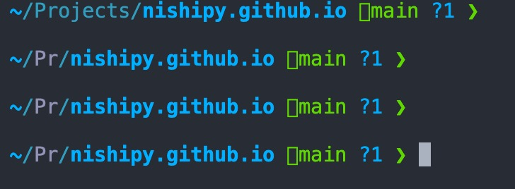
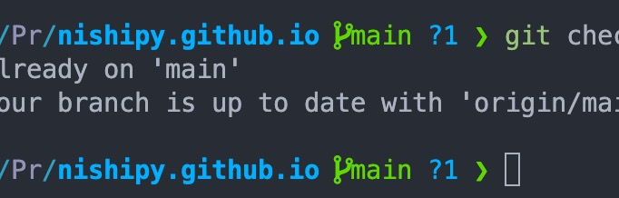

## VSCodeのIntegrated Terminalでアイコンが表示されない

zsh + Powerlevel10k を使い始めたんですが、VSCode内のIntegrated Terminalでおしゃれなアイコンがうまく表示されずの地味に困りました。

## フォントを正しく指定しましょう

この [gist](https://gist.github.com/480/3b41f449686a089f34edb45d00672f28) を参考にして、`setting.json` に `"terminal.integrated.fontFamily": "MesloLGS NF"` を設定すれば上手くいきました。

