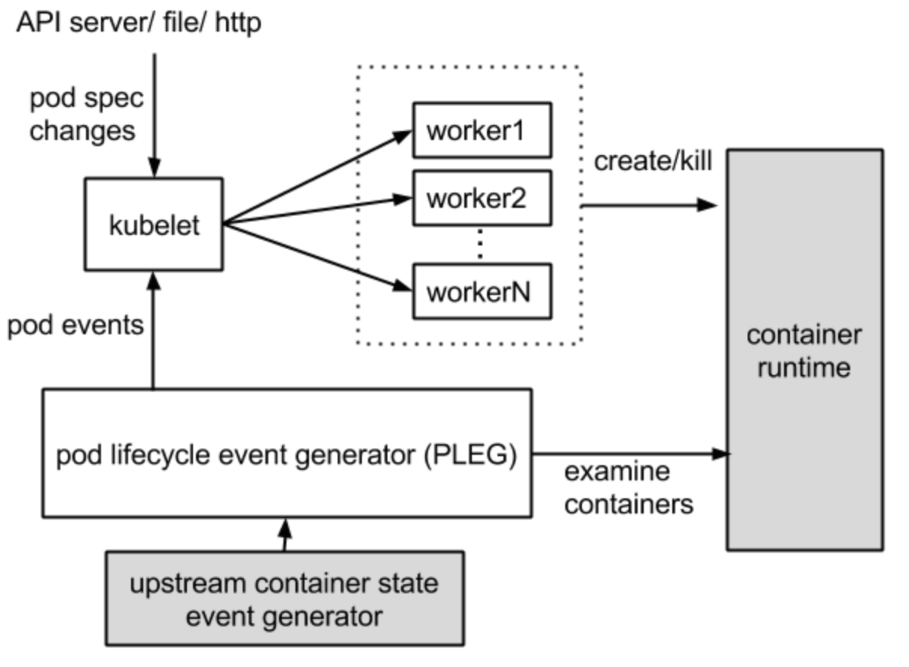
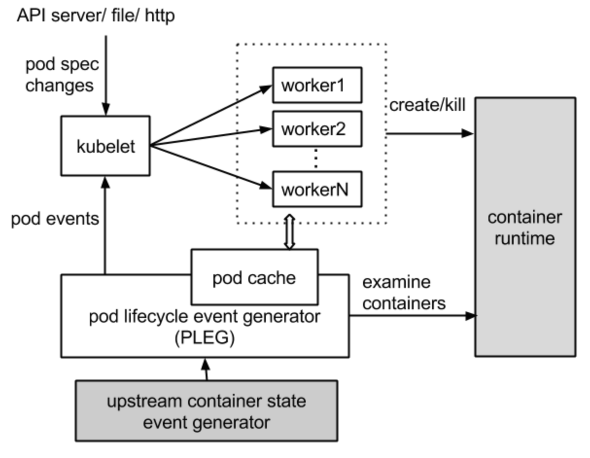

Note: This article is a translation of [「kubeletのPLEGをソースコード読んで理解したかった」](https://nishipy.com/archives/1958).
[Kubelet](https://kubernetes.io/docs/reference/command-line-tools-reference/kubelet/) has a lot of components, and one of the most important ones is PLEG, which stands for "Pod Lifecycle Event Generator". In this article, we'll look into the implementation to understand how PLEG works.

## NotReady nodes due to "PLEG is not healthy"

In Kubernetes, there are various causes for nodes to become NotReady state. [For example](https://access.redhat.com/solutions/3258011), a node may become NotReady with output like `PLEG is not healthy: pleg was last seen active 3m20s ago; threshold is 3m0s. PLEG(←?!) was last seen active 3m20s ago; threshold is 3m0s It seems that the last time PLEG(←?!) was active was 3m20s ago; threshold is 3m0s `, so it seems that it was judged as abnormal because it exceeded the threshold of 3 minutes. I don't know what it's talking about, what the heck is PLEG...


## PLEG

PLEG is part of kubelet and stands for Pod Lifecycle Event Generator. An overview was found in [Concepts in Kubernetes Japanese documentation](https://kubernetes.io/ja/docs/concepts/). Below is its translation with DeepL.

```
> Once the desired state is set, the *Kubernetes control plane* using the Pod Lifecycle Event Generator (PLEG) functions to match the current state of the cluster to the desired state. To do so, Kubernetes automatically performs various tasks (e.g., starting or restarting containers, scaling the number of replicas of a particular application, etc.).
```

Okay, that sounds very important. There is an embedded link to PLEG's Design Proposal in this document, but it seems to be out of date and I cannot access it. Apparently, the old Design Proposal has been moved to [kubernetes/design-proposals-archive](https://github.com/kubernetes/design-proposals-archive). We can find the PLEG [here](https://github.com/kubernetes/design-proposals-archive/blob/main/node/pod-lifecycle-event-generator.md).

It seems to be responsible for talking to Container Runtime and the main loop of kubelet, as shown below.

> 
> 
> cited from: https://github.com/kubernetes/design-proposals-archive/blob/main/node/pod-lifecycle-event-generator.md#overview

非推奨

### Relisting in PLEG

According to the chapter [Detect Changes in Container States Via Relisting](https://github.com/kubernetes/design-proposals-archive/blob/main/node/pod-lifecycle-event-generator.md#detect-changes-in-container-states-via-relisting), it is designed to detect container state changes by a process called "relisting". 

- PLEG relist all containers periodically to detect container state changes
- It helps prevent all Pod Workers from polling the container runtime in parallel
- Therefore only Pod Workers that need Sync will be launched, which is even more efficient


## Pod Workers

FYI, [Pod Worker](https://github.com/kubernetes/kubernetes/blob/release-1.25/pkg/kubelet/pod_workers.go#L303-L378) is implemented here. It's also a component of kubelet, and `keeps track of operations on pods and ensures each pod is reconciled with the container runtime and other subsystems`.


## Runtime Pod Cache

We also need to know the Runtime Pod Cache to look into PLEG.
The design proposal is [here](https://github.com/kubernetes/design-proposals-archive/blob/main/node/runtime-pod-cache.md).

> 
> 
> cited from: https://github.com/kubernetes/design-proposals-archive/blob/main/node/runtime-pod-cache.md#runtime-pod-cache

The diagram is almost the same as the one we saw for PLEG, but a box named "pod cache" is added between PLEG and Pod Workers.

The Runtime Pod Cache is an in-memory cache that stores the state of all pods and is used to synchronize pods; it is managed by PLEG and acts as a Single Source of Truth (SSOT) for the internal pod status, so that kubelets do not need to directly query the container runtime directly.

PLEG is responsible for updating the Pod Cache entries, keeping the cache up-to-date at all times. The design seems to be to process in the following order, generating and sending the corresponding Pod Lifecycle Event only when there is a change in the Pod.

1. Detect change of container state
2. Inspect the pod for details
3. Update the pod cache with the new PodStatus

## More information and source code

Now that we have understood a little about PLEG, let's look into it in more detail.

First of all, the following article will help a lot to understand it with many diagrams and snippets of source codes. Please note that the information in it is as of Kubernetes 1.14.

- [Pod Lifecycle Event Generator: Understanding the "PLEG is not healthy" issue in Kubernetes | Red Hat Developer](https://developers.redhat.com/blog/2019/11/13/pod-lifecycle-event-generator-understanding-the-pleg-is-not-healthy-issue-in-kubernetes#)


## In the next article...
It might be sufficient to read the above for understanding, but the version of Kubernetes is a little old.
Therefore, I'll read the source code of Kubernetes 1.25 in the next. 
